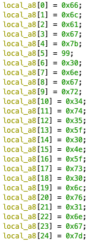
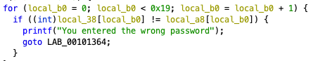

## ASCII

Please find the password to break through this binary

## Solution

After finding the main function, we see two crucial parts of the code when it is disassembled:

 

From the for loop, we can tell that `local_a8` is what our input (`local_38`) is getting checked against. We then know that `local_a8` has 25 characters based on the first image, and they are each stored as hex. Inside the for loop, our input gets casted as an integer, which means that our input gets turned into its ascii representation. Therefore, we know that the values inside `local_a8` are ascii representations of characters since we're checking our input with that. Thus, we just convert all of the hex values into characters using an online converter and get the flag.

Flag: `flag{c0ngr4t5_0N_s0lv1ng}`
