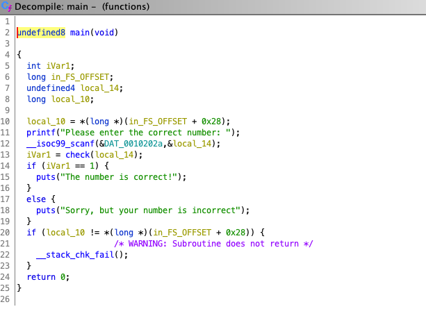

## Functions

Please find the number that will bypass the binary.

Hint: wrap the number in the flag format. For example, if the number was 123, the flag would be `flag{123}`.

## Solution

First, open this file in Ghidra and search main in the filter bar. After double clicking on the main function, you should see this on the right side: 

Notice that iVar1 needs to equal to 1 for the code to say that it is successful and that the value of iVar1 is determined by the function `check`. Therefore, we just double click the `check`, and we will see another function called `check2`. We click into that and get `check3`, click into that and get `check4`, and then finally, `check4` returns 1 if our parameter (which is our input) is equal to `0x98383` and returns 0 if it's not equal to that. 

The number is in hex, so we just convert it to base 10 and get the correct number. 

Number: `623491`

Flag: `flag{623491}`
